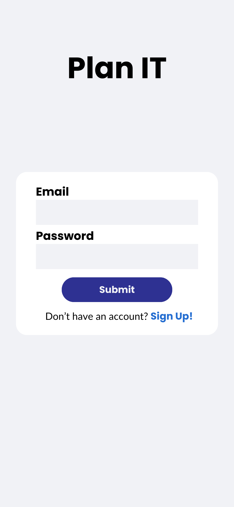
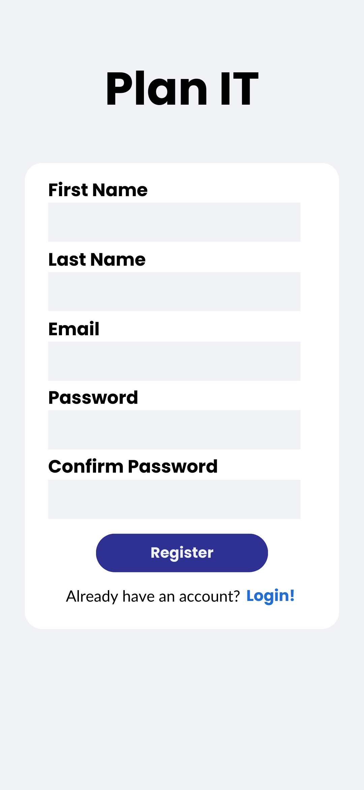
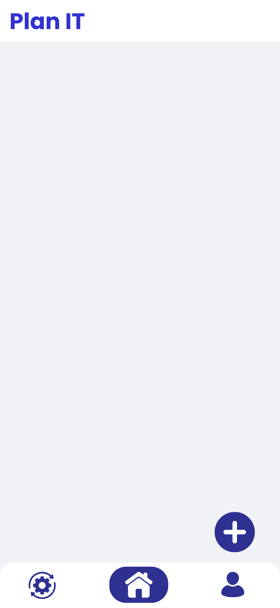
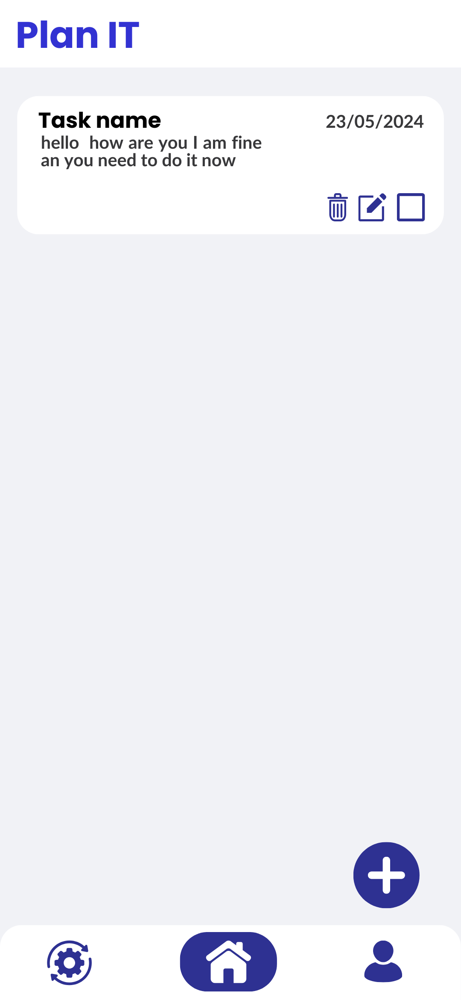
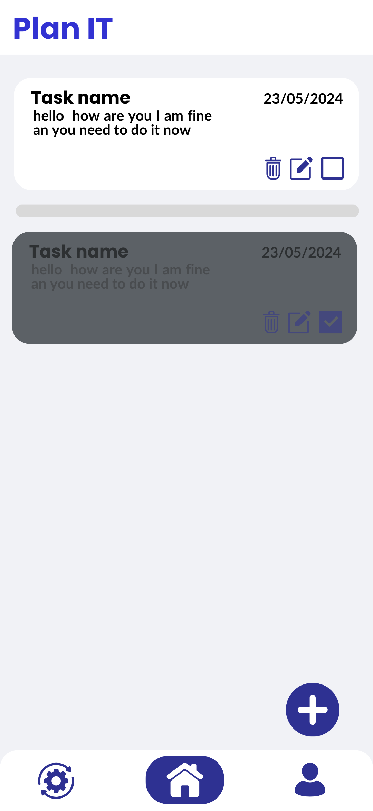
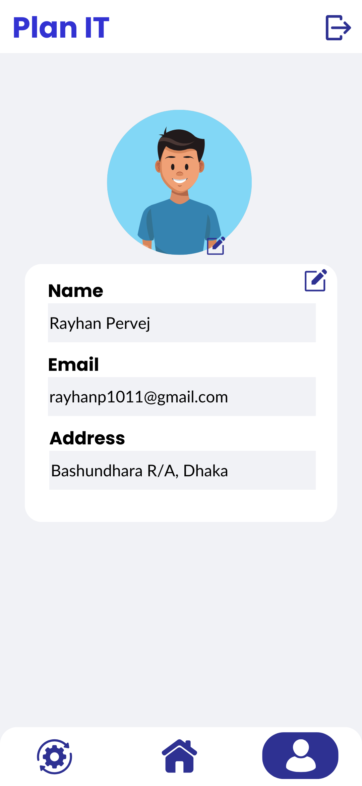
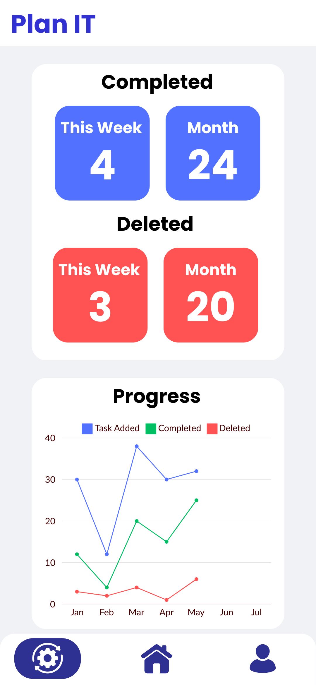
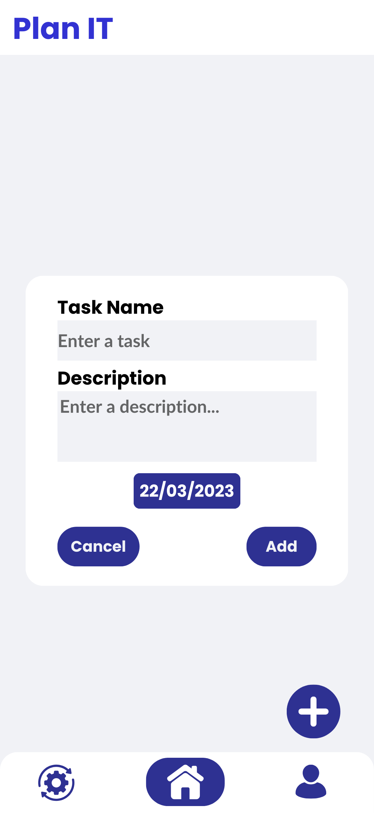
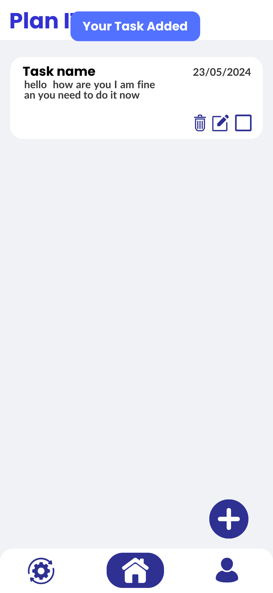
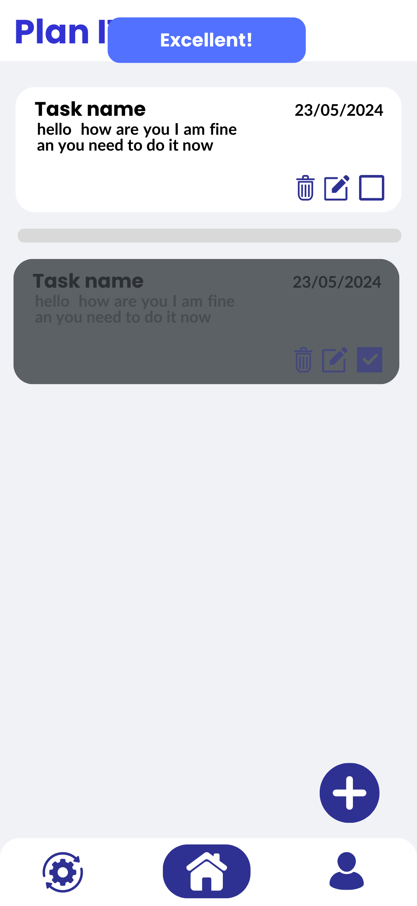

## Task Management Mobile App##

# Tools
  1. Flutter
  2. Firebase

## App Screenshots

| Welcome Screen   | Login            | Sign Up          |
|-------------------|------------------|------------------|
|  |  |  |

| Home             | Home (Task Added) | Home (Task Completed) |
|-------------------|-------------------|------------------------|
|  |  |  |

| Profile          | Status           | Add Task         |
|-------------------|------------------|------------------|
|  |  |  |

| Task Added Alert | Task Completed Alert |
|-------------------|-----------------------|
|  |  |
